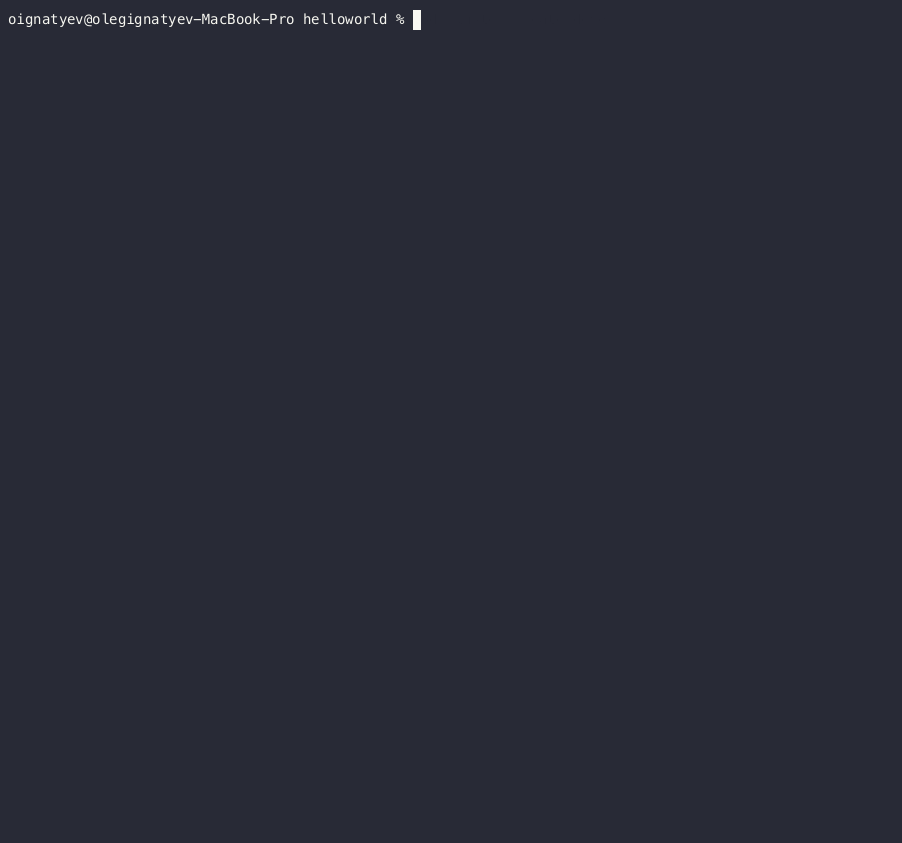
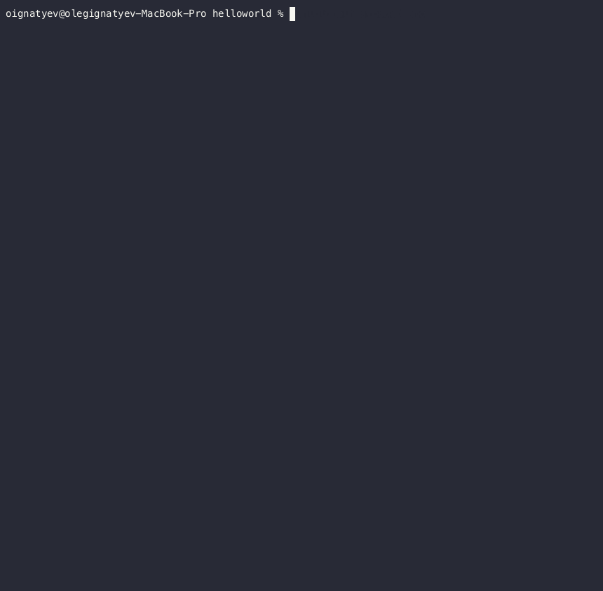

AsciiArtify - Concept
---


|                                     | minikube                                                          | k3d                                                                 | kind                                                                                 |
|-------------------------------------|-------------------------------------------------------------------|---------------------------------------------------------------------|--------------------------------------------------------------------------------------|
| Deployment option                   | Stand-alone, container-based                                      | Container-based                                                     | Container-based                                                                      |
| OS                                  | Win, MacOS, Linux. Additional compatibility with various drivers (including Docker, kvm2,	VirtualBox)   | Linux (optimized for Linux). Win and MacOS through the use of VM    | Linux, Win and MacOS. Multiple versions of Kubernetes. Supports variety of container runtimes (Docker, containerd, CRI-O)|
| CLI Available                       | Yes (more options)                                                | Yes, but less features                                              | Yes, similar to k3d                                                                  |
| Architecture                        | arm, x86_64/amd64                                                 | arm, x86_64/amd64                                                   | arm, x86_64/amd64                                                                    |
| Dashboard and metrics               | Kubernetes dashboard                                              | Comes with metrics server                                           | Need to install dashboard separately                                                 |
| Documentaion                        | Comprehensive                                                     | Good, sometimes comprehensive sometimes weak                        | Good                                                                                 |
| Support and community               | Kubernetes SIGs project                                           | Community-driven product, a wrapper for k3s (Rancher product)       | Kubernetes SIGs project                           |
| Pros and Cons                       | Single-node Kubernetes cluster; good performance but longer to bring up and tear down, many reviews, mostly used option         | Single-node and multi-node option, very light and fast | Option to run multiple clusters (including HA) on single machine, usage in CI/CD pipelines, solid Podman support, often considered good for beginners               |


The list of commands to create k3d cluster and deploy custom hello-world container:

```
k3d cluster create demo
kubectl create deploy demo --image olegign82/demo:v1.0.1
kubectl get po -w
kubectl port-forward deploy/demo 8080
```




Test from another terminal window before starting k3d cluster and after (response received):

```
curl 127.0.0.1:8080
```



---
k3d is a container-based Kubernetes solution equipped with a user-friendly CLI. Notably, it comes pre-packaged with a metrics server, supports multi-node clusters, and includes a Kubernetes version selector. Its standout feature, however, lies in its remarkable startup performance, making it an excellent choice for running integration tests within CI pipelines.

kind - as a container-based Kubernetes solution with a CLI, Kind offers a lightweight and user-friendly approach to running local Kubernetes clusters. It is a Kubernetes special interest group project that supports multi-node clusters and provides a Kubernetes version selector. Although its startup performance may not match that of K3D, Kind is a reliable choice for container-based local Kubernetes deployments.

minikube - what makes Minikube special is that it’s not just a container-based solution but supports also various VM technologies, making it a standalone solution as well. Its feature set is very rich: It has a Kubernetes version selector, offers a metrics server, Kubernetes dashboard, and various other additions. However, in terms of startup performance, Minikube’s speed may not match that of K3D and Kind. Nevertheless, its flexibility and wide range of features make it a dependable choice for local Kubernetes deployments.


**Conclusion:**
---

Consiring all the tools (minikube, k3d and kind) are very close in nature and suitable for our needs, there is no big difference which one to use.
The suggestion was to use k3d due to it being the most lightweight solution, an easy one and also the one we had experience with in the past.
